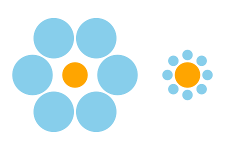

Optical Illusions
----------------

### Cafe Wall

Dividing lines between rows are parallel, but they appear to be sloped!

Source code: [cafe-wall.rkt](cafe-wall.rkt)

### Ebbinghaus illusion

Both orange circles are of the same size, but the one on the right appears to be larger!

Source code: [ebbinghaus.rkt](ebbinghaus.rkt)

